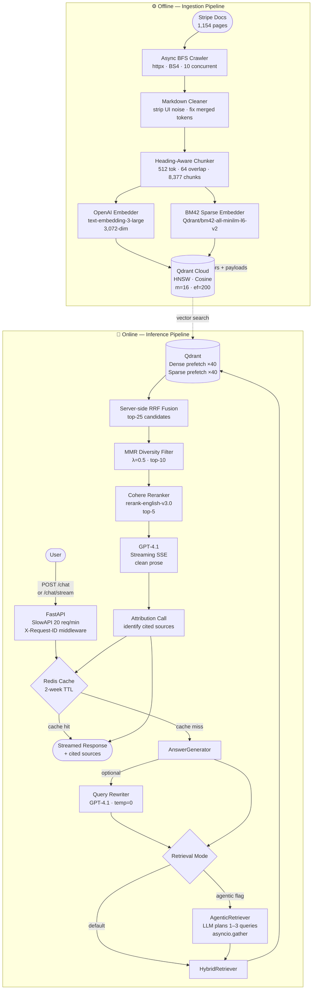

# Stripe RAG Chatbot


A production-quality Retrieval-Augmented Generation (RAG) chatbot over the official Stripe documentation. It crawls 1,154 pages across four Stripe doc sections, indexes 8,377 chunks in Qdrant with hybrid dense + sparse retrieval, and serves grounded, cited answers via a streaming FastAPI backend.

---

## Architecture



---

## Tech Stack

| Concern | Choice | Detail |
|---|---|---|
| **Crawler** | `httpx` + `BeautifulSoup4` + `markdownify` | Async BFS, 10 concurrent, Stripe docs are fully SSR'd — no Playwright needed |
| **Chunking** | Custom `HeadingAwareChunker` | Splits on h1–h4 boundaries, heading path prepended to every chunk |
| **Tokenisation** | `tiktoken` `cl100k_base` | 512-token chunks, 64-token overlap |
| **Dense embeddings** | OpenAI `text-embedding-3-large` | 3,072-dim, Cosine similarity |
| **Sparse embeddings** | `fastembed` BM42 | `Qdrant/bm42-all-minilm-l6-v2-attentions`, runs locally |
| **Vector DB** | Qdrant Cloud | HNSW (m=16, ef_construct=200), hybrid dense+sparse collection |
| **Retrieval** | Hybrid RRF + MMR | Dense×40 + Sparse×40 prefetch → server-side RRF → MMR diversity filter |
| **Reranking** | Cohere `rerank-english-v3.0` | `NoOpReranker` fallback if key absent |
| **LLM** | `gpt-4.1` | Two-call strategy: prose stream + fast attribution call |
| **Cache** | Redis (`redis[asyncio]`) | Exact-match on normalised question, 2-week TTL |
| **API** | FastAPI + uvicorn | SSE streaming, rate limiting, session management |
| **Rate limiting** | `slowapi` | 20 req/min per IP on `/chat` endpoints |
| **Observability** | LangSmith `@traceable` | Every pipeline stage traced: retrieve → rerank → generate |
| **Evaluation** | Custom LLM-as-judge | 4 metrics via direct OpenAI calls with JSON mode — no RAGAS |
| **Deployment** | Docker + Fly.io | `python:3.13-slim`, BM42 pre-downloaded at build, 512 MB RAM |

---

## Retrieval Pipeline

The retrieval chain balances recall, precision, and diversity before committing to expensive LLM generation:

```
User query
    │
    ├─ [optional] Query Rewriter (GPT-4.1, temp=0)
    │       Expands abbreviations, adds Stripe-specific terms
    │
    ├─ Dense prefetch  (top-40) ─┐
    │                             ├── Qdrant server-side RRF → top-25
    └─ Sparse prefetch (top-40) ─┘       score = Σ 1/(60+rank)
                                   │
                                   ├── MMR diversity filter (λ=0.5) → top-10
                                   │       Maximises: λ·sim(chunk,query) − (1−λ)·max_sim(chunk,selected)
                                   │
                                   └── Cohere Reranker (rerank-english-v3.0) → top-5
                                               │
                                              GPT-4.1
```

| Stage | Input | Output | Notes |
|---|---|---|---|
| Dense prefetch | Query | 40 candidates | OpenAI `text-embedding-3-large` → Qdrant HNSW |
| Sparse prefetch | Query | 40 candidates | BM42 → Qdrant sparse index |
| RRF fusion | 80 candidates | 25 chunks | Server-side: `score = Σ 1/(60+rank)` |
| MMR | 25 chunks | 10 diverse chunks | Pure numpy, ~1 ms, λ=0.5 |
| Reranking | 10 chunks | 5 chunks | Cohere `rerank-english-v3.0`, semantic 0–1 scores |
| Generation | 5 chunks | Streamed answer | GPT-4.1, SSE tokens + cited sources |

---

## Key Design Decisions

**Two-call attribution strategy**
Generation uses two LLM calls: (1) stream clean prose with no `[Source N]` markers in the answer text, (2) a fast non-streaming follow-up that asks "which source numbers did you draw from?" and returns only actually-cited chunks to the client. This keeps the prose natural while still surfacing accurate citations.

**Agentic retrieval (opt-in)**
`AgenticRetriever` uses the LLM as a query planner — it generates 1–3 targeted `{query, section}` pairs in JSON, executes them in parallel via `asyncio.gather`, then merges results by `chunk_id` keeping the highest score. Toggled by a code-level constant (`AGENTIC_RETRIEVAL_ENABLED`) rather than an env var, preventing accidental production activation.

**MMR diversity filter**
After RRF fusion, Maximal Marginal Relevance selects chunks that are both relevant to the query *and* dissimilar to each other. This prevents the reranker from receiving 10 near-duplicate chunks about the same paragraph of documentation.

**Redis response cache**
Exact-match cache on normalised questions (`lowercase + collapse whitespace`), keyed as `rag:v1:{section}:{question}`. Multi-turn requests (with history) bypass the cache since responses depend on prior context. Redis failures are silent — treated as cache miss.

**LLM-as-judge evaluation (no RAGAS)**
RAGAS was removed after producing unreliable 0% scores due to opaque internal LangChain chain failures. Each metric is now a single direct `chat.completions.create()` call with `response_format={"type":"json_object"}` — fully transparent and debuggable.

**Heading-path prepending**
Every chunk is prefixed with its full heading hierarchy (`Payments > Accept a payment > Server-side`). This gives the dense embedder richer context and dramatically improves retrieval for section-scoped queries.

**Model API compatibility**
`_is_new_api_model()` detects o-series and gpt-5+ models and automatically switches to `max_completion_tokens` (dropping `temperature`), making the codebase forward-compatible with new OpenAI models.

---

## Project Structure

```
stripe-rag-chatbot/
├── src/stripe_rag/
│   ├── config.py                   # Pydantic-settings: all runtime config + agentic toggle
│   ├── cache.py                    # Redis ResponseCache (normalised key, 2-week TTL)
│   │
│   ├── crawler/
│   │   ├── crawler.py              # Async BFS: asyncio.Queue + Semaphore(10)
│   │   ├── extractor.py            # HTML → ATX markdown (markdownify)
│   │   └── models.py               # RawPage, ExtractedPage dataclasses
│   │
│   ├── ingestion/
│   │   ├── cleaner.py              # clean_markdown(): 7 noise-removal passes
│   │   ├── chunker.py              # HeadingAwareChunker: h1–h4 splits + recursive fallback
│   │   ├── embedder.py             # OpenAIEmbedder (async, batch=100) + SparseEmbedder (BM42)
│   │   ├── indexer.py              # QdrantIndexer: HNSW + sparse, upsert retry (5×, 4–60s)
│   │   └── pipeline.py             # chunk_documents(), embed_and_index()
│   │
│   ├── retrieval/
│   │   ├── retriever.py            # HybridRetriever: dense+sparse prefetch, RRF, MMR
│   │   ├── reranker.py             # CohereReranker + NoOpReranker + get_reranker()
│   │   ├── agentic_retriever.py    # AgenticRetriever: plan-then-execute, asyncio.gather
│   │   └── models.py               # RetrievedChunk dataclass
│   │
│   ├── generation/
│   │   ├── generator.py            # AnswerGenerator: guard → cache → retrieve → rerank → generate
│   │   └── prompts.py              # SYSTEM_PROMPT, format_context_blocks(), REFUSAL_PATTERNS
│   │
│   ├── api/
│   │   ├── main.py                 # FastAPI app, lifespan (startup/shutdown), session cleanup
│   │   ├── schemas.py              # ChatRequest, ChatResponse, SourceRef, HealthResponse
│   │   ├── middleware.py           # RequestIDMiddleware: X-Request-ID + JSON access log
│   │   ├── limiter.py              # SlowAPI Limiter singleton
│   │   └── routes/
│   │       ├── chat.py             # POST /chat, POST /chat/stream (20/min rate limit)
│   │       └── health.py           # GET /health, GET /ready
│   │
│   └── evaluation/
│       ├── eval_set.py             # 25 Q&A pairs across api/payments/billing/webhooks
│       └── runner.py               # LLM-as-judge: 4 metrics via direct OpenAI JSON calls
│
├── scripts/
│   ├── run_crawl.py                # CLI: crawl Stripe docs → data/documents.jsonl
│   ├── run_index.py                # CLI: chunk → embed → index (--stage, --no-recreate)
│   ├── smoke_test.py               # Qdrant health + retrieval sanity check
│   └── run_eval.py                 # Evaluation suite → results table + LangSmith URL
│
├── data/                           # gitignored
│   ├── documents.jsonl             # 1,154 crawled pages
│   └── chunks.jsonl                # 8,377 chunks
│
├── Dockerfile                      # python:3.13-slim, non-root, BM42 pre-downloaded
├── fly.toml                        # Fly.io: 512 MB, 1 shared CPU, CDG region
└── pyproject.toml                  # setuptools, all deps, ruff/mypy config
```

---

## Setup

### Prerequisites

- Python 3.13
- A [Qdrant Cloud](https://cloud.qdrant.io) free-tier cluster (or local Qdrant via `docker run -p 6333:6333 qdrant/qdrant`)
- OpenAI API key
- Redis (local or managed) — required for caching; set `CACHE_ENABLED=false` to skip

### Install

```bash
git clone https://github.com/Mostafa-M-Abla/stripe-rag-chatbot
cd stripe-rag-chatbot

python -m venv .venv
.venv/Scripts/pip install -e ".[dev]"   # Windows
# .venv/bin/pip install -e ".[dev]"    # macOS/Linux
```

### Environment Variables

Create a `.env` file in the project root:

```env
# Required
OPENAI_API_KEY=sk-...
QDRANT_URL=https://your-cluster.qdrant.io
QDRANT_API_KEY=...

# Observability (optional but recommended)
LANGSMITH_API_KEY=...
LANGSMITH_PROJECT=stripe-rag-chatbot
LANGSMITH_TRACING=true

# Reranking (optional — NoOpReranker used if absent)
COHERE_API_KEY=...

# Caching (optional — requires Redis)
REDIS_URL=redis://localhost:6379
CACHE_ENABLED=true

# Tuning overrides (defaults shown)
LLM_MODEL=gpt-4.1
MMR_ENABLED=true
QUERY_REWRITING_ENABLED=false
```

**Full reference:**

| Variable | Default | Description |
|---|---|---|
| `OPENAI_API_KEY` | — | OpenAI API key (**required**) |
| `QDRANT_URL` | `http://localhost:6333` | Qdrant cluster URL (**required**) |
| `QDRANT_API_KEY` | `None` | Qdrant API key (Cloud only) |
| `QDRANT_COLLECTION_NAME` | `stripe_docs` | Collection name |
| `LLM_MODEL` | `gpt-4.1` | Answer generation model |
| `LLM_TEMPERATURE` | `0.1` | LLM temperature |
| `LLM_MAX_TOKENS` | `1024` | Max response tokens |
| `OPENAI_EMBEDDING_MODEL` | `text-embedding-3-large` | Dense embedding model |
| `RETRIEVAL_DENSE_TOP_K` | `40` | Dense prefetch candidates |
| `RETRIEVAL_SPARSE_TOP_K` | `40` | Sparse prefetch candidates |
| `RETRIEVAL_FINAL_TOP_K` | `25` | RRF fusion output size |
| `COHERE_API_KEY` | `None` | Enables Cohere reranker |
| `COHERE_RERANK_TOP_N` | `5` | Chunks passed to LLM |
| `MMR_ENABLED` | `true` | MMR diversity filter |
| `MMR_LAMBDA` | `0.5` | MMR relevance/diversity trade-off (0=diversity, 1=relevance) |
| `MMR_TOP_K` | `10` | Chunks selected by MMR |
| `REDIS_URL` | `redis://localhost:6379` | Redis connection URL |
| `CACHE_ENABLED` | `true` | Enable response cache |
| `CACHE_TTL_SECONDS` | `1209600` | Cache TTL (default: 2 weeks) |
| `QUERY_REWRITING_ENABLED` | `false` | LLM query rewriting pre-step |
| `LANGSMITH_API_KEY` | `None` | LangSmith tracing |
| `LANGSMITH_PROJECT` | `stripe-rag-chatbot` | LangSmith project name |
| `LANGSMITH_TRACING` | `true` | Enable tracing |

---

## Running the Pipeline

### 1 — Crawl

```bash
# Smoke test (10 pages)
.venv/Scripts/python scripts/run_crawl.py --max-pages 10

# Full crawl (~1,154 pages, ~5–10 min)
.venv/Scripts/python scripts/run_crawl.py
```

Outputs: `data/documents.jsonl`, `data/raw_html/`, `data/markdown/`

### 2 — Index

```bash
# Full pipeline: chunk → embed → index (drops + recreates collection)
.venv/Scripts/python scripts/run_index.py

# Upsert into existing collection (skip recreate)
.venv/Scripts/python scripts/run_index.py --no-recreate

# Run individual stages
.venv/Scripts/python scripts/run_index.py --stage chunk
.venv/Scripts/python scripts/run_index.py --stage embed
```

Outputs: `data/chunks.jsonl` (~8,377 chunks), Qdrant collection `stripe_docs`

### 3 — Verify

```bash
.venv/Scripts/python scripts/smoke_test.py
```

Checks collection health (point count, HNSW config) and runs a test hybrid query.

### 4 — Serve

```bash
.venv/Scripts/uvicorn stripe_rag.api.main:app --reload
# API at http://localhost:8000
```

### 5 — Evaluate

```bash
.venv/Scripts/python scripts/run_eval.py
```

Runs 25 Q&A pairs, prints a results table, and logs per-question scores to LangSmith.

---

## API Reference

### `POST /chat`

Blocking request/response. Rate limited to 20 requests/minute per IP.

**Request:**
```json
{
  "question": "How do I create a PaymentIntent?",
  "section_filter": "payments",
  "session_id": "uuid-or-null"
}
```

**Response:**
```json
{
  "answer": "To create a PaymentIntent, call stripe.paymentIntents.create() ...",
  "sources": [
    {
      "url": "https://docs.stripe.com/api/payment_intents/create",
      "title": "Create a PaymentIntent",
      "heading_path": "Stripe API Reference > PaymentIntents > Create"
    }
  ],
  "latency_ms": 1243.5,
  "model": "gpt-4.1",
  "session_id": "550e8400-e29b-41d4-a716-446655440000"
}
```

### `POST /chat/stream`

Server-Sent Events stream. Same request body as `/chat`.

**SSE event sequence:**
```
data: {"type": "token", "text": "To "}
data: {"type": "token", "text": "create a PaymentIntent"}
...
data: {"type": "sources", "sources": [{...}]}
data: {"type": "done", "session_id": "550e8400-..."}
```

### `GET /health`

Always returns 200. Pings Qdrant to populate `qdrant_connected`.

```json
{"status": "ok", "qdrant_connected": true, "version": "0.1.0"}
```

### `GET /ready`

Returns `200` if Qdrant is reachable, `503` otherwise. Used by load-balancer health checks.

---

## Evaluation

Evaluation uses a custom LLM-as-judge framework with four metrics. Each is a single `chat.completions.create()` call with `response_format={"type":"json_object"}`, returning `{"score": float, "reasoning": str}`.

| Metric | Target | What it measures |
|---|---|---|
| **Faithfulness** | ≥ 0.80 | Fraction of answer claims grounded in retrieved context (no hallucination) |
| **Answer Relevancy** | ≥ 0.75 | How directly and completely the answer addresses the question |
| **Context Recall** | ≥ 0.75 | Fraction of key facts from the reference answer present in retrieved chunks |
| **Factual Correctness** | ≥ 0.75 | Accuracy of API names, parameters, and processes vs. reference answer |

The eval set contains 25 hand-crafted Q&A pairs covering all four Stripe doc sections. Results and per-question reasoning are logged to LangSmith under the `stripe-rag-chatbot` project.

---

## Deployment

### Docker

```bash
docker build -t stripe-rag-chatbot .
docker run -p 8080:8080 --env-file .env stripe-rag-chatbot
```

The `Dockerfile` uses `python:3.13-slim`, runs as a non-root `appuser`, and pre-downloads the BM42 model at build time to eliminate cold-start delays.

### Fly.io

```bash
fly secrets set OPENAI_API_KEY=... QDRANT_URL=... QDRANT_API_KEY=...
fly deploy
```

Configuration (`fly.toml`):

| Setting | Value |
|---|---|
| Region | CDG (Paris) |
| Memory | 512 MB |
| CPUs | 1 shared |
| Health check | `GET /health` every 15s, 10s timeout |
| HTTPS | Force-enabled |
| Min machines | 1 always running |

---

## Development

```bash
# Lint
.venv/Scripts/ruff check src/

# Type check
.venv/Scripts/mypy src/

# Tests
.venv/Scripts/pytest tests/ -v
```

---

## License

MIT
